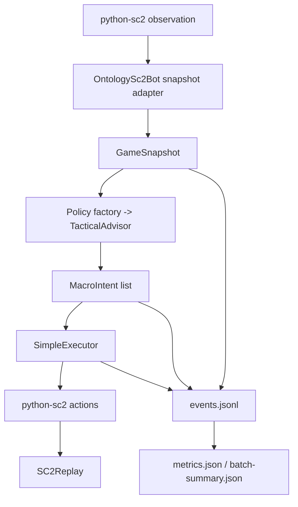

# V0.2 架构

## 总体数据流



## python-sc2 适配层

依赖使用 `burnysc2==7.3.0`，导入名为 `sc2`。`OntologySc2Bot` 是唯一负责
`BotAI` 生命周期的类：`on_start` 设置 `self.client.game_step`，`on_step` 组织快照、
决策和执行，`on_end` 固化结果。它不包含规则细节或建造位置算法。

运行器通过 `maps.get(map_name)` 选择本地地图，用 `Bot(Race.Terran, bot)` 和
`Computer(race, difficulty)` 创建对局，并把 `save_replay_as` 指向独立 run 路径。

## GameSnapshot

`GameSnapshot` 是冻结、可序列化的 dataclass。它只保存数字、布尔、字符串 tuple，
绝不保存 `Unit`、`Units`、`Point2` 或 tag。除了需求中的资源、人口、单位、建筑和
敌方可见数量，它还保存 ready/idle/pending 计数，供纯策略判断当前是否安全提交命令。

这个边界允许规则测试完全不启动 SC2，也允许 V0.3 把同一快照映射为本体实例。

## TacticalAdvisor 与 MacroIntent

`TacticalAdvisor` 是结构化 `Protocol`：

```python
def recommend(self, snapshot: GameSnapshot) -> list[MacroIntent]: ...
```

`policy.factory.create_advisor(config: BotConfig) -> TacticalAdvisor` 在每场游戏创建一个
独立 advisor。`hierarchical` 是默认值；`simple` 保留为 V0.1 规则的消融选项。后者产生
有限 `IntentType`、优先级、原因、创建 game loop 和少量标量参数，仍可用于基线比较。

默认的 `HierarchicalRulePolicy` 先更新 `StrategicBlackboard`，再调用生产与战斗两个
上层策略控制器。它们通过黑板协调 Economy、Construction、Production、Technology、
Scout、Combat 六个 Manager；Manager 提交候选 `MacroIntent`，`CommandScheduler` 统一
按紧急性、优先级、任务状态和资源/气体/人口/建造工人/生产设施预算仲裁。它不会把
BurnySc2 对象带入领域层。

除 `TacticalAdvisor.recommend()` 外，策略可选实现 `ExecutionAwareAdvisor`，接收每个
意图的执行结果以维护有限重试、冷却、超时和重新规划；也可实现
`TraceableAdvisor.drain_events()`，将领域事件交给日志与指标层。只实现 `recommend()`
的 simple 与本体 stub 保持兼容。分层状态仅属于一场游戏的 advisor，因此 batch 会为
每局重新创建 advisor。

当前唯一分层策略是两基地 Marine/Marauder Stim：补给、气矿、扩张、两个 Barracks 和
addon、Stim、约 2:1 的部队生产、SCV 侦察、基地防守、集结、主力进攻和增援。它不是
论文的 Zerg/PySC2 实验或结果复现；不包含本体推理、学习、多种族、多套策略、高级单位
组合、反隐或逐单位微操，也不承诺胜率。

`OntologyAdvisorStub` 只证明替换接口存在，默认返回空列表，不安装或调用任何
RDF/OWL 组件；这些 V0.3 工作尚未实现。

## 执行器

`SimpleExecutor` 是领域意图到 BurnySc2 命令的翻译层。它检查：

- 资源和人口；
- Command Center/Barracks 是否 ready 且 idle；
- Supply Depot 科技前置；
- `find_placement` 是否找到位置；
- `select_build_worker` 是否找到工人；
- 可见敌方建筑，否则回退到已知敌方出生点。

返回状态含义：

- `accepted`：命令已经交给 BurnySc2；
- `waiting`：资源、人口或生产队列等短暂条件不足；
- `rejected`：宏观前置条件不成立；
- `failed`：位置、工人、目标或底层命令提交失败。

首次达到阈值时全体 Marine 进攻；之后只为 idle 增援重新下达进攻命令，避免每个决策
周期覆盖正在战斗部队的命令。

## 日志、指标和失败边界

`EventLogger` 每写一条 JSONL 就 flush，避免异常时整局日志丢失。
`MetricsCollector` 只聚合领域值。runner 是允许捕获宽泛 `Exception` 的进程边界：
它必须先写 `error.json` 和失败指标，再抛出带 run ID 的 `GameRunError`。批量 runner
捕获每局失败并立即更新汇总。

## 为什么本体系统不直接输出单位级动作

单位级动作依赖瞬时位置、tag、技能冷却、碰撞和每帧时序，变化快且难以在本体中稳定
表达。本体更适合回答“扩产、侦察、进攻或防守”等语义层问题。让本体只输出受限
`MacroIntent`，再由经过验证的执行层处理资源、位置和 API 细节，可解释性、可测试性
和安全边界都更清楚。
